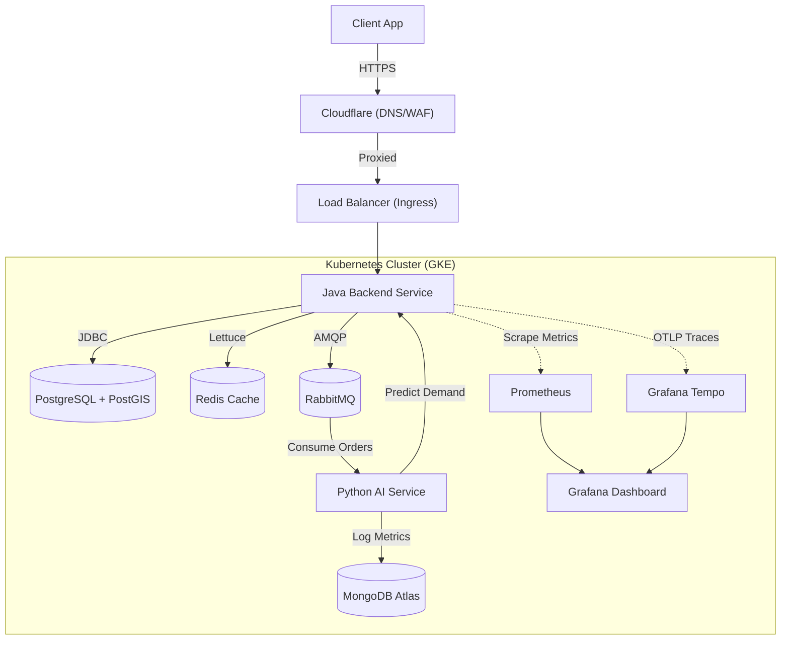

# Last-Mile Delivery Backend Engine


[](https://xofyy.com/)

## 📖 Overview
**Live Production URL:** [https://xofyy.com](https://xofyy.com)

A high-performance, scalable backend engine for a Last-Mile Delivery application. Built with **Java 21** and **Spring Boot 3**, this project implements industry best practices including **Layered Architecture**, **Event-Driven Design**, and **Geo-spatial Logic** using **PostGIS**. It features a microservices architecture with a Python-based AI service for demand prediction.

## 🚀 Key Features
- **Smart Courier Assignment:** Uses **PostGIS** (`ST_DWithin`, `ST_Distance`) to assign the nearest available courier to an order in real-time.
- **Event-Driven Architecture:** Asynchronous communication between services using **RabbitMQ**.
- **AI-Powered Demand Prediction:** Python microservice using **Scikit-Learn** to predict order demand based on historical data.
- **High Performance:** **Redis** caching for high-frequency data access.
- **Infrastructure as Code:** Fully automated GCP infrastructure provisioning using **Terraform**.
- **Kubernetes Native:** Deployed on **GKE** (Google Kubernetes Engine) using **Helm Charts**.
- **GitOps CI/CD:** Automated deployment pipeline using **GitHub Actions** following Git Flow (Dev -> Prod).

## 🛠 Technology Stack

### Backend & AI
- **Java 21 (LTS)** & **Spring Boot 3.2** (Backend)
- **Python 3.9** & **FastAPI** (AI Service)
- **PostgreSQL 16** + **PostGIS** (Primary Database)
- **Redis 7** (Caching)
- **RabbitMQ 3** (Message Broker)
- **MongoDB Atlas** (AI Logs & Analytics)

### Infrastructure & DevOps
- **Google Cloud Platform (GCP)**
- **Cloudflare** (DNS, SSL, DDoS Protection)
- **Terraform** (Infrastructure as Code)
- **Docker** & **Docker Compose**
- **Kubernetes (GKE)**
- **Helm** (Package Manager)
- **GitHub Actions** (CI/CD)
- **Prometheus & Grafana** (Monitoring & Observability)
- **Locust** (Load Testing)

## 🏗 Architecture

The system consists of two main services and shared infrastructure components, protected by Cloudflare:



## 📊 Monitoring & Observability
The cluster is equipped with a comprehensive monitoring stack installed via **Helm**:

-   **Prometheus:** Scrapes metrics from the **Java Backend** (via Spring Boot Actuator `/actuator/prometheus`) and Kubernetes nodes.
-   **Grafana:** Visualizes system health, request rates, latency, and resource usage (CPU/Memory) through custom dashboards.
-   **Grafana Tempo:** Provides **Distributed Tracing** to visualize the lifecycle of requests across microservices.
-   **Spring Boot Actuator:** Exposes application-level metrics (JVM, JVM, JDBC, HTTP) for Prometheus to consume.

### Accessing Dashboards
To access the centralized logging and tracing dashboards:

1.  **Establish Port Forward:**
    ```bash
    kubectl port-forward svc/loki-grafana -n monitoring 3000:80
    ```
2.  **Open Grafana:** Navigate to [http://localhost:3000](http://localhost:3000)
3.  **Login:** Default user is `admin`.
4.  **Explore:** Use the **Explore** tab to query logs (`Loki`) or search traces (`Tempo`).

## 🌐 External Services & Integrations
Since this project relies on modern cloud-native principles, some components are managed externally and integrated via configuration rather than code:

-   **Cloudflare:** Acts as the entry point for all traffic. It handles **DNS resolution**, **SSL termination**, and provides **DDoS protection** before traffic reaches our GKE Ingress.
-   **MongoDB Atlas:** A fully managed cloud NoSQL database used by the **AI Service** to store unstructured training logs and prediction history. Connected via secure connection strings injected as Kubernetes Secrets.

## 🏃 Getting Started

### Prerequisites
- Docker & Docker Compose
- Java 21 JDK
- Python 3.9+
- Terraform (for cloud infra)
- Google Cloud SDK (`gcloud`)
- `kubectl` & `helm`

### Local Development
You can run the entire stack locally using Docker Compose.

1.  **Clone the repository:**
    ```bash
    git clone https://github.com/xofyy/Last-Mile-Delivery-Backend-Engine.git
    cd Last-Mile-Delivery-Backend-Engine
    ```

2.  **Start Services:**
    ```bash
    docker-compose up -d --build
    ```
    *This starts Backend (8080), AI Service (8000), Postgres (5432), Redis (6379), and RabbitMQ (5672/15672).*

3.  **Access APIs:**
    - **Swagger UI:** [http://localhost:8080/swagger-ui.html](http://localhost:8080/swagger-ui.html)
    - **RabbitMQ Management:** [http://localhost:15672](http://localhost:15672) (User: `guest`, Pass: `guest`)

### Production Access
The application is live at **[https://xofyy.com](https://xofyy.com)**.
- **API Base URL:** `https://xofyy.com/api`
- **Swagger UI:** `https://xofyy.com/swagger-ui.html` (Protected/Internal)

## ☁️ Cloud Infrastructure (GCP)

The project uses **Terraform** to provision a production-ready environment on Google Cloud.

### Structure
- `infra/terraform/gcp/modules`: Reusable modules for VPC and GKE.
- `infra/terraform/gcp/environments/dev`: Development environment configuration.
- `infra/terraform/gcp/environments/prod`: Production environment configuration.

### Provisioning
1.  Navigate to the environment directory:
    ```bash
    cd infra/terraform/gcp/environments/dev
    ```
2.  Initialize and Apply:
    ```bash
    terraform init
    terraform apply
    ```

## ☸️ Kubernetes Deployment (Helm)

We use **Helm Charts** to manage Kubernetes manifests dynamically for different environments.

- **Chart Path:** `k8s/charts/delivery-app`
- **Values Files:**
    - `values.yaml`: Default configurations.
    - `values-dev.yaml`: Overrides for Dev (Low resources, ClusterIP).
    - `values-prod.yaml`: Overrides for Prod (High availability, LoadBalancer).

### Manual Deployment
```bash
helm upgrade --install delivery-app ./k8s/charts/delivery-app \
  -f ./k8s/charts/delivery-app/values-dev.yaml \
  --namespace default
```

## 🔄 CI/CD Pipeline

The project follows **Git Flow** for automated deployments via **GitHub Actions**:

1.  **Develop Branch (`develop`):**
    - Pushing to `develop` triggers deployment to the **Dev Cluster**.
    - Uses `values-dev.yaml`.
    - Ideal for testing new features.

2.  **Main Branch (`main`):**
    - Merging `develop` to `main` triggers deployment to the **Prod Cluster**.
    - Uses `values-prod.yaml`.
    - Production-ready stable release.

## 🧪 Testing

### Load Testing
We use **Locust** to simulate high traffic and test system resilience.

1.  **Install Locust:**
    ```bash
    pip install locust
    ```
2.  **Run Load Test:**
    ```bash
    locust -f scripts/locustfile.py --host http://localhost:8080
    ```

### Unit & Integration Tests
Run standard Java tests using Maven:
```bash
mvn test
```

## 📄 License
This project is licensed under the MIT License.
